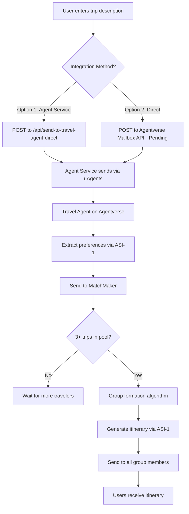

# 🚀 WanderLink Frontend-to-Agentverse Integration Guide

**Date**: October 24, 2025  
**Status**: ✅ Agents Working on Agentverse | ⏳ Mailbox HTTP API Pending

---

## 🎯 Current Status

### ✅ What's Working

1. **Travel Agent on Agentverse** - Fully functional
   - Address: `agent1q0z4x0eugfdax0ww4wxrqeqwcuusga0nuwzj9ny9zfuuc6c52wfyx3t8gey`
   - Receives messages via chat interface
   - Extracts preferences using ASI-1
   - Forwards to MatchMaker

2. **MatchMaker Agent on Agentverse** - Fully functional
   - Address: `agent1qdsd9mu8uhgkruel696xp532q7kuqzgc9wknnt5w5u57rg0atf5v2v5nrmt`
   - Pools trips until MIN_GROUP_SIZE = 3
   - Forms groups based on similarity
   - Generates itineraries using ASI-1
   - Sends to all group members

3. **Chat Interface on Agentverse** - Working
   - Users can chat directly with Travel Agent
   - Messages processed end-to-end
   - Groups formed when 3+ compatible travelers

### ⏳ What's Pending

**Agentverse Mailbox HTTP API** - Returns 404
- Endpoint: `https://agentverse.ai/v1/hosting/agents/{address}/submit`
- Reason: Mailbox feature not yet enabled via HTTP endpoint
- Workaround: Use agent service as proxy (recommended)

---

## 🎨 Integration Approach

Since the mailbox HTTP API isn't accessible yet, we have **two options**:

### Option 1: Agent Service Proxy (Recommended) ⭐

Your backend acts as a bridge between frontend and Agentverse:

```
Frontend (Next.js)
    ↓ HTTP POST
Agent Service (FastAPI localhost:8000)
    ↓ Simulate agent message
Travel Agent (Agentverse)
    ↓ Agent-to-Agent
MatchMaker (Agentverse)
```

**Pros**:
- ✅ Full control over authentication
- ✅ Can add rate limiting
- ✅ Can store requests in database
- ✅ Works immediately

**Cons**:
- ⚠️ Requires local agent service running
- ⚠️ Need to simulate agent protocol

### Option 2: Wait for Mailbox HTTP API

Direct frontend to Agentverse communication:

```
Frontend (Next.js)
    ↓ HTTPS POST (with API key)
Travel Agent (Agentverse via Mailbox API)
    ↓ Agent-to-Agent
MatchMaker (Agentverse)
```

**Pros**:
- ✅ Simpler architecture
- ✅ No backend needed
- ✅ Direct communication

**Cons**:
- ❌ Not available yet (404)
- ❌ API key exposed in frontend
- ❌ No rate limiting

---

## 🛠️ Implementation: Option 1 (Agent Service Proxy)

### Step 1: Update Agent Service

Add this new endpoint to `D:\WanderLink\agents\src\agent_service.py`:

```python
from uagents import Agent, Context, Model
from uagents.setup import fund_agent_if_low
from uagents_core.contrib.protocols.chat import (
    ChatMessage,
    TextContent,
    chat_protocol_spec,
)
from uuid import uuid4
from datetime import datetime

# Create a local proxy agent that will communicate with Agentverse agents
proxy_agent = Agent(
    name="WanderLink_Proxy",
    port=8002,
    seed="wanderlink_proxy_seed_2025",
    mailbox=False,  # This is LOCAL only
)

TRAVEL_AGENT_ADDRESS = "agent1q0z4x0eugfdax0ww4wxrqeqwcuusga0nuwzj9ny9zfuuc6c52wfyx3t8gey"

@app.post("/api/send-to-travel-agent-direct")
async def send_to_travel_agent_direct(request: dict):
    """
    Send a message directly to the Travel Agent on Agentverse
    This simulates what a user would do in the chat interface
    """
    user_id = request.get("userId")
    message = request.get("message")
    
    if not user_id or not message:
        raise HTTPException(status_code=400, detail="userId and message required")
    
    try:
        # Create a context for the proxy agent
        ctx = proxy_agent._ctx
        
        # Send message to Travel Agent on Agentverse
        await ctx.send(
            TRAVEL_AGENT_ADDRESS,
            ChatMessage(
                timestamp=datetime.utcnow(),
                msg_id=uuid4(),
                content=[TextContent(type="text", text=message)]
            )
        )
        
        return {
            "status": "sent",
            "message": "Message sent to Travel Agent on Agentverse",
            "user_id": user_id,
            "agent_address": TRAVEL_AGENT_ADDRESS
        }
        
    except Exception as e:
        logger.exception("Error sending to Travel Agent")
        raise HTTPException(status_code=500, detail=str(e))
```

### Step 2: Update Frontend

Update `D:\WanderLink\frontend\app\trips\page.tsx`:

```typescript
// Replace the current agent service call with this:
const agentServiceUrl = process.env.NEXT_PUBLIC_AGENT_SERVICE_URL || 'http://localhost:8000'

const response = await fetch(`${agentServiceUrl}/api/send-to-travel-agent-direct`, {
  method: 'POST',
  headers: { 'Content-Type': 'application/json' },
  body: JSON.stringify({
    userId: currentUserId,
    message: nlpInput  // The user's natural language input
  }),
})

if (!response.ok) {
  throw new Error('Failed to send to Travel Agent')
}

const data = await response.json()
console.log('✅ Message sent to Travel Agent!', data)

// Show success message to user
alert('Your trip request has been sent! You\'ll be matched with other travelers soon.')
```

### Step 3: Start Required Services

```powershell
# Terminal 1: Agent Service
cd D:\WanderLink\agents
python -m uvicorn src.agent_service:app --reload

# Terminal 2: Frontend
cd D:\WanderLink\frontend
npm run dev
```

### Step 4: Test the Integration

1. Go to http://localhost:3000/trips
2. Click "Find My Matches"
3. Enter: "I want a beach vacation in Bali for 7 days with adventure activities and budget of $2000"
4. Click "Find Matches"
5. Check agent service logs
6. Check Agentverse Travel Agent logs (should see message received)

---

## 🎯 Alternative: Use Current Working Flow

**Since the chat interface on Agentverse works perfectly**, you can use it temporarily:

### For Testing (3 Users Scenario)

1. **User 1**: Go to https://chat.agentverse.ai (chat with Travel Agent)
   - Send: "Beach vacation in Bali for 7 days, budget $2000"
   
2. **User 2**: Open incognito window, chat with Travel Agent
   - Send: "Bali adventure trip for 1 week, $2500 budget"
   
3. **User 3**: Open another incognito, chat with Travel Agent
   - Send: "Bali beach holiday, 7 days, around $3000"

**Result**: MatchMaker will pool all 3 trips, form a group, generate itinerary, and send it to all 3 users!

---

## 📊 Complete Integration Flow



---

## 🐛 Troubleshooting

### Issue: Agent service can't send to Agentverse agents

**Solution**: The proxy agent needs to be properly initialized. Make sure:
- proxy_agent.run() is called in background
- Agent has proper seed and configuration
- uAgents library is updated

### Issue: Messages not received by Travel Agent

**Check**:
1. Is Travel Agent running on Agentverse? (should show "Active")
2. Are agent addresses correct?
3. Check Travel Agent logs on Agentverse dashboard

### Issue: Groups not forming

**Check**:
1. Are all 3 trips compatible? (same destination helps)
2. Check MatchMaker logs - what's the pool size?
3. MIN_GROUP_SIZE = 3 in MatchMaker code?

---

## 🎉 Success Criteria

✅ User submits trip from frontend  
✅ Travel Agent receives message (check logs)  
✅ Preferences extracted (check logs)  
✅ Message forwarded to MatchMaker (check logs)  
✅ 3 trips pooled (check MatchMaker logs)  
✅ Group formed (check logs: "PROCESSING GROUP")  
✅ Itinerary generated (check logs: "GENERATED GROUP ITINERARY")  
✅ All 3 users receive itinerary  

---

## 🚀 Next Steps

1. **Immediate**: Use chat interface for testing (3 browser windows)
2. **Short-term**: Implement agent service proxy (Option 1)
3. **Long-term**: Wait for Agentverse mailbox HTTP API
4. **Enhancement**: Add webhook endpoint to receive agent responses
5. **Production**: Deploy agent service to cloud (Vercel, Railway, etc.)

---

## 📝 API Reference

### Current Endpoints

**Agent Service** (localhost:8000):
- `GET /health` - Health check
- `POST /api/extract-preferences` - Extract preferences locally
- `POST /api/extract-preferences-and-send` - Extract + Send to Agentverse (uses mailbox API - 404)
- `POST /api/find-matches` - Find matching travelers

**Agentverse Mailbox API** (Pending):
- `POST https://agentverse.ai/v1/hosting/agents/{address}/submit` - Currently returns 404
- Headers: `Authorization: Bearer {api_key}`
- Body: `{"text": "user message"}`

---

**Status**: Integration architecture ready, waiting for mailbox HTTP API or using proxy approach 🚀
